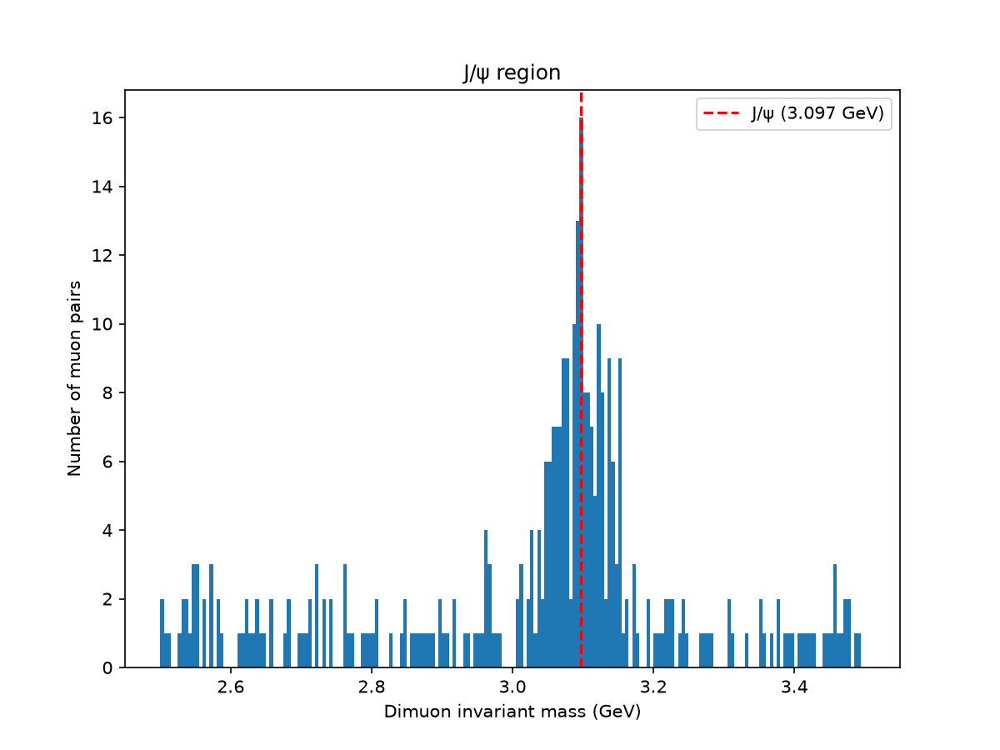
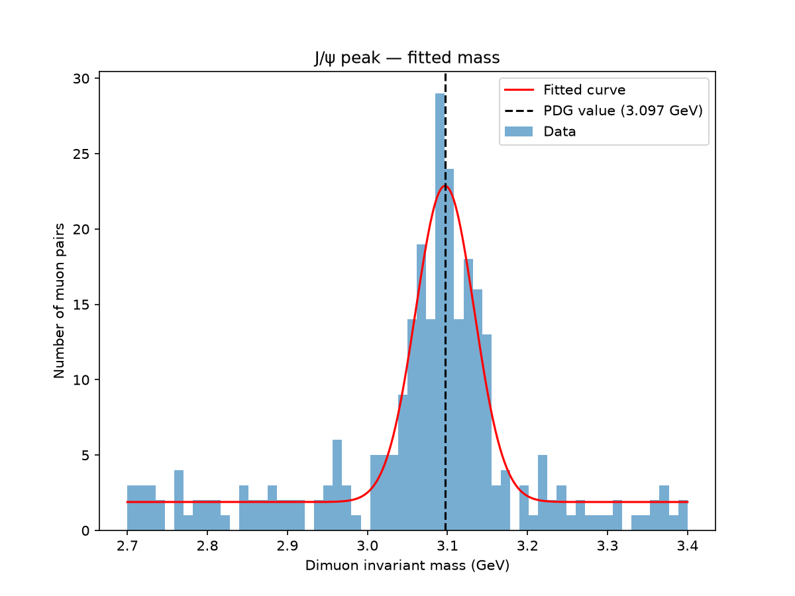
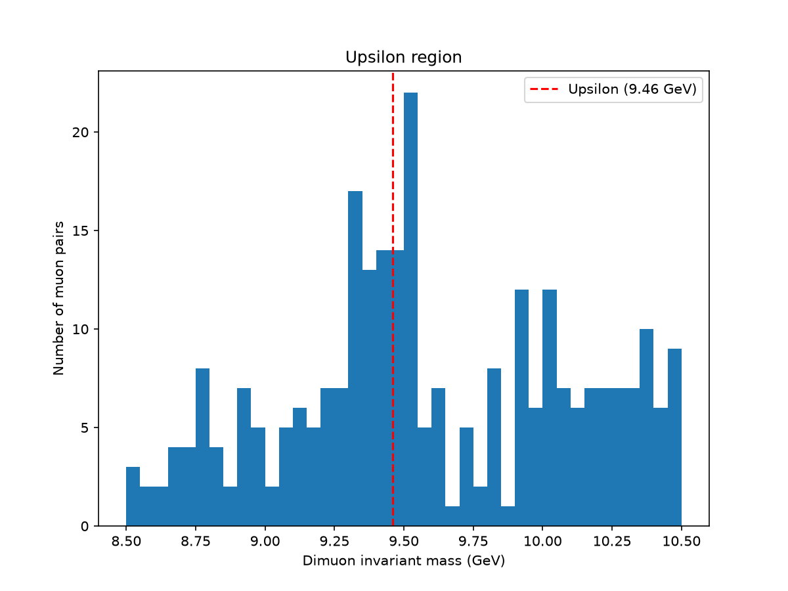
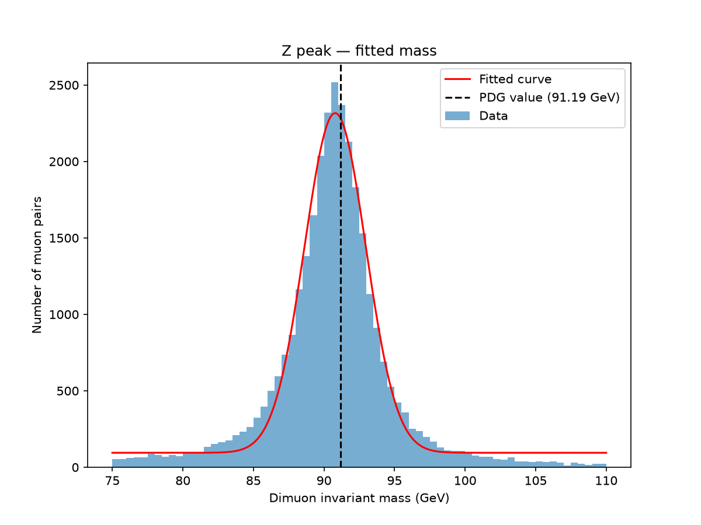
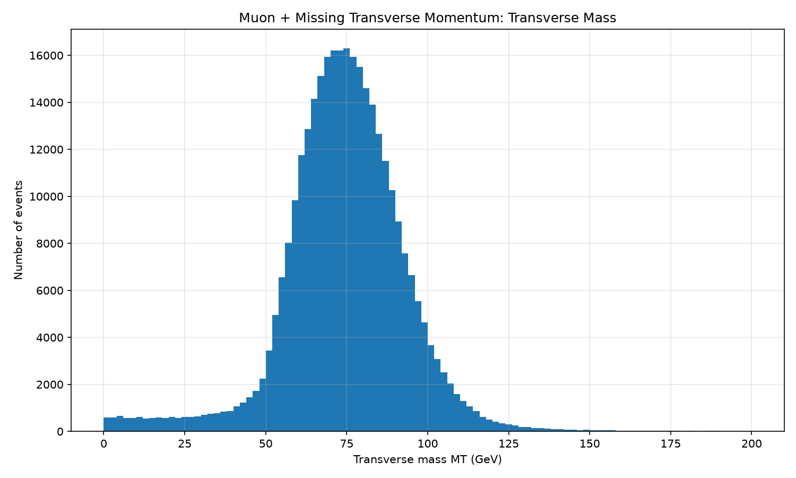
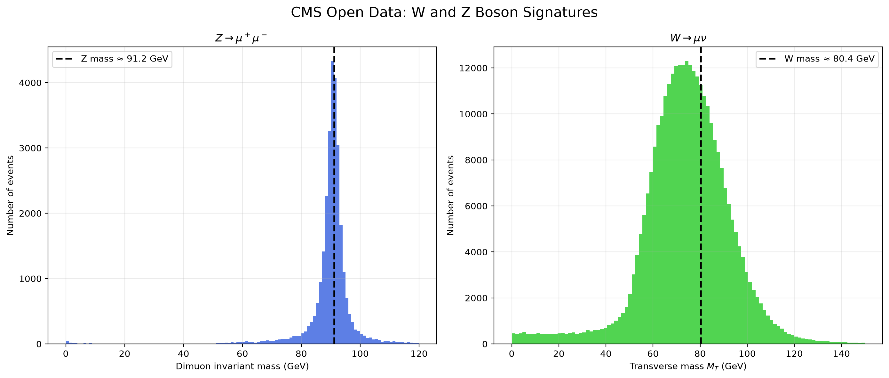
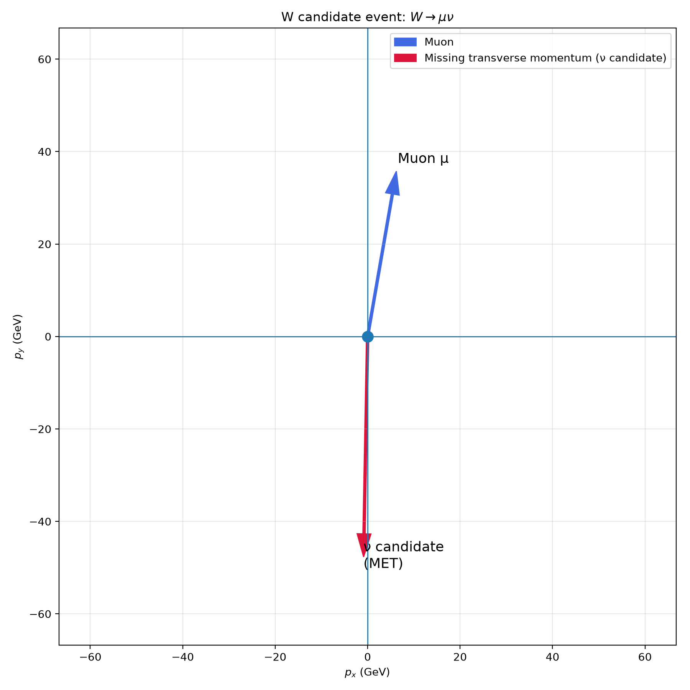

# CMS Collision Analysis

Reconstructing J/ψ, Υ, Z, and W boson signatures from real CMS Open Data using muon kinematics, invariant mass, missing transverse momentum (MET), and transverse mass.

The analysis covers visible dimuon resonances,

$$
J/\psi \rightarrow \mu^+\mu^-,\quad
\Upsilon \rightarrow \mu^+\mu^-,\quad
Z \rightarrow \mu^+\mu^-
$$

followed by the partially invisible decay

$$
W \rightarrow \mu\nu
$$

where the neutrino is inferred through missing transverse momentum.

## Data

The analysis uses real CMS Open Data stored in ROOT format. Two CMS event samples containing approximately 1 million collision events in total were analyzed. The ROOT files contain reconstructed physics objects including muons and missing transverse momentum. The raw ROOT files are not included in the repository because of their large size.

## Tools

- Python
- Uproot
- Awkward Array
- NumPy
- Matplotlib

## Dimuon Resonance Reconstruction

The analysis begins with reconstructed muons.

For events containing at least two muons, the two leading-$p_T$ muons are selected and required to have opposite charge:

$$
q_1 q_2 < 0
$$

The muons are converted into four-vectors using their transverse momentum $p_T$, pseudorapidity $\eta$, azimuthal angle $\phi$, and mass. For each muon,

$$
p_x = p_T \cos\phi,\quad
p_y = p_T \sin\phi,\quad
p_z = p_T \sinh\eta
$$

and

$$
E = \sqrt{p_x^2 + p_y^2 + p_z^2 + m_\mu^2}
$$

The dimuon invariant mass is calculated as

$$
m_{\mu\mu} = \sqrt{(E_1 + E_2)^2 - (p_{x1} + p_{x2})^2 - (p_{y1} + p_{y2})^2 - (p_{z1} + p_{z2})^2}
$$

A resonance appears as an excess of events around its characteristic mass.

### J/ψ

The dimuon invariant-mass spectrum was first investigated around the J/ψ mass. The decay

$$
J/\psi \rightarrow \mu^+\mu^-
$$

produces a characteristic resonance near

$$
m_{J/\psi} \approx 3.097~\mathrm{GeV}
$$

A clear peak is observed around this value.

  

A Gaussian-plus-background fit was also performed to study the J/ψ peak.

  

This demonstrates the reconstruction of a resonance from its visible decay products.

### Υ

The same dimuon invariant-mass technique was used to investigate the Υ resonance. The Υ(1S) mass is approximately

$$
m_{\Upsilon(1S)} \approx 9.46~\mathrm{GeV}
$$

The dimuon spectrum was examined around this region to search for the corresponding resonance signature.

  

The J/ψ and Υ analyses use the same underlying principle:

$$
\text{two visible decay products} \rightarrow \text{invariant mass} \rightarrow \text{resonance}
$$

### Z Boson

The same dimuon invariant-mass reconstruction was then used to study the Z boson. The decay

$$
Z \rightarrow \mu^+\mu^-
$$

is particularly suitable for invariant-mass reconstruction because both decay products are visible. Tighter muon selections were applied using:

- `Muon_tightId`
- Relative isolation $< 0.15$
- $p_T^\mu > 25$ GeV
- Opposite charge

The resulting dimuon mass distribution shows a strong resonance around

$$
m_Z \approx 91.2~\mathrm{GeV}
$$

  

The analysis therefore recovers particle signatures across very different mass scales, from the J/ψ at approximately 3.1 GeV to the Z boson at approximately 91.2 GeV.

## Missing Transverse Momentum

The analysis then moves from fully visible decays to a decay containing an invisible particle:

$$
W \rightarrow \mu\nu_\mu
$$

The muon can be reconstructed by the detector, while the neutrino does not leave a directly measurable track. Instead, the neutrino's transverse momentum is inferred from the event's missing transverse momentum, represented by $\vec{p}_T^{\,miss}$.

The CMS data provides its magnitude and direction through `MET_pt` and `MET_phi`. For a $W \rightarrow \mu\nu$ event, the missing transverse momentum can be interpreted as the neutrino's transverse-momentum footprint:

$$
\vec{p}_T^{\,\nu} \approx \vec{p}_T^{\,miss}
$$

This is an inference from the momentum imbalance in the event rather than a direct measurement of the neutrino.

## W Boson Through Transverse Mass

Because the neutrino's complete three-dimensional momentum is unknown, the ordinary invariant mass cannot be reconstructed in the same way as for the Z boson. Instead, the transverse mass is calculated using

$$
M_T = \sqrt{2\, p_T^\mu\, \mathrm{MET}\, (1 - \cos\Delta\phi)}
$$

The angular separation is

$$
\Delta\phi = |\phi_\mu - \phi_{\mathrm{MET}}|,\qquad 0 \le \Delta\phi \le \pi
$$

W candidate events were selected using:

- Exactly one good muon
- $p_T^\mu > 25$ GeV
- Tight muon identification
- Relative isolation $< 0.15$
- MET $> 25$ GeV

The resulting transverse-mass distribution shows the characteristic W-boson signature, with the distribution concentrated around the W mass scale and falling toward the expected kinematic endpoint near

$$
m_W \approx 80.4~\mathrm{GeV}
$$

  

Unlike the Z boson, the W boson does not produce a narrow invariant-mass peak in this reconstruction because the neutrino's longitudinal momentum is unknown.

## W and Z Comparison

The W and Z analyses demonstrate two different approaches to reconstructing unstable particles.

For the Z boson, $Z \rightarrow \mu^+\mu^-$, both decay products are visible, so the invariant mass can be reconstructed directly.

For the W boson, $W \rightarrow \mu\nu$, the neutrino is invisible, so missing transverse momentum and transverse mass are used instead.

  

| Particle | Decay | Observable |
|---|---|---|
| J/ψ | $\mu^+\mu^-$ | Dimuon invariant mass |
| Υ | $\mu^+\mu^-$ | Dimuon invariant mass |
| Z | $\mu^+\mu^-$ | Dimuon invariant mass |
| W | $\mu\nu$ | MET + transverse mass |

## Visualizing the Invisible Neutrino

The neutrino cannot be directly plotted as a reconstructed detector object because its momentum is not fully measured. However, its transverse momentum footprint can be visualized using the missing transverse momentum. For a selected W candidate event, the muon and MET are converted into Cartesian transverse momentum components:

$$
p_x = p_T \cos\phi,\quad p_y = p_T \sin\phi
$$

These vectors are displayed in the transverse $p_x$–$p_y$ plane.

  

The detected muon is represented by its measured transverse momentum vector. The missing transverse momentum vector represents the momentum imbalance in the event and is interpreted as the neutrino candidate's transverse momentum in the $W \rightarrow \mu\nu$ topology. The visualization therefore shows the difference between a directly reconstructed particle and an invisible particle inferred from missing momentum.

## Analysis Summary

The analysis reconstructs several recognizable particle-physics signatures from CMS Open Data.

**Visible resonances**

$$
J/\psi \rightarrow \mu^+\mu^-,\quad
\Upsilon \rightarrow \mu^+\mu^-,\quad
Z \rightarrow \mu^+\mu^-
$$

These are studied through the dimuon invariant mass $m_{\mu\mu}$.

**Partially invisible decay**

$$
W \rightarrow \mu\nu
$$

This is studied through MET and

$$
M_T = \sqrt{2\, p_T^\mu\, \mathrm{MET}\, (1 - \cos\Delta\phi)}
$$

The neutrino is not directly observed. Its transverse-momentum contribution is inferred through the missing transverse momentum.

## Results

The analysis demonstrates:

- Reconstruction of the J/ψ resonance near 3.1 GeV
- Investigation of the Υ resonance near 9.46 GeV
- Reconstruction of the Z boson resonance near 91.2 GeV
- Identification of a W-boson signature through transverse mass
- Visualization of an individual neutrino transverse-momentum candidate using MET
- Application of four-vector kinematics to real CMS collision data

The analysis moves from directly reconstructing visible resonances to inferring the presence of an invisible particle through conservation of transverse momentum.
